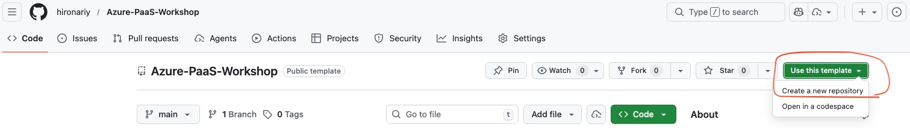

# Azure PaaS Workshop

[](https://github.com/hironariy/Azure-PaaS-Workshop/actions/workflows/infrastructure-deploy.yml)
[](https://github.com/hironariy/Azure-PaaS-Workshop/actions/workflows/backend-deploy.yml)
[](https://github.com/hironariy/Azure-PaaS-Workshop/actions/workflows/azure-static-web-apps.yml)
[](https://opensource.org/licenses/MIT)

> 🎓 **Workshop Repository** - Click "Use this template" to create your own copy!

Learn Azure PaaS services by deploying a full-stack blog application with:
- **Azure Static Web Apps** - React frontend with global distribution
- **Azure App Service** - Node.js Express API backend
- **Azure Cosmos DB for MongoDB vCore** - Managed database
- **Azure Application Gateway + WAF** - Web Application Firewall protection
- **GitHub Actions** - CI/CD pipeline with OIDC authentication

---

## Table of Contents

- [1. Introduction](#1-introduction)
  - [1.1 About This Workshop](#11-about-this-workshop)
  - [1.2 What You Will Learn](#12-what-you-will-learn)
  - [1.3 Application Overview](#13-application-overview)
- [2. Prerequisites](#2-prerequisites)
  - [2.1 Required Tools](#21-required-tools)
  - [2.2 Required Accounts](#22-required-accounts)
  - [2.3 Entra ID Permissions](#23-entra-id-permissions)
- [3. Getting Started](#3-getting-started)
- [4. Workshop Modules](#4-workshop-modules)
- [5. Cost Estimate](#5-cost-estimate)
- [6. Cleanup](#6-cleanup)

---

## 1. Introduction

### 1.1 About This Workshop

This workshop is designed for engineers who want to learn **Azure Platform as a Service (PaaS)** patterns by building a real-world, production-ready web application.

**Target Audience:**
- Engineers with 3-5 years of experience (particularly those familiar with AWS)
- Developers preparing for Azure certifications (AZ-104, AZ-305)
- Teams modernizing from IaaS to PaaS architectures

**Workshop Duration:** approximately 3-4 hours

**Companion Workshop:** This is the PaaS version of the [Azure IaaS Workshop](https://github.com/hironariy/Azure-IaaS-Workshop). Complete both to understand the differences between IaaS and PaaS approaches!

### 1.2 What You Will Learn

By completing this workshop, you will gain hands-on experience with:

| Topic | Azure Services |
|-------|----------------|
| **Serverless Hosting** | Static Web Apps, App Service |
| **Managed Database** | Cosmos DB for MongoDB vCore |
| **Security** | Application Gateway WAF, Private Endpoints, Key Vault |
| **Networking** | Virtual Networks, VNet Integration, NAT Gateway |
| **Identity** | Microsoft Entra ID, Managed Identities |
| **Infrastructure as Code** | Bicep templates |
| **CI/CD** | GitHub Actions with OIDC authentication |

### 1.3 Application Overview

The sample application is a **multi-user blog platform** with the following features:

**For All Users (Public):**
- 📖 Browse and read published blog posts
- 🔍 View post details with author information

**For Authenticated Users:**
- ✍️ Create, edit, and delete your own blog posts
- 📝 Save posts as drafts before publishing
- 👤 Manage your profile and view your posts

**Technology Stack:**

| Layer | Technology |
|-------|------------|
| Frontend | React 18, TypeScript, TailwindCSS, Vite |
| Backend | Node.js 20, Express.js, TypeScript |
| Database | Cosmos DB for MongoDB vCore |
| Authentication | Microsoft Entra ID with MSAL.js |

---

## 2. Prerequisites

### 2.1 Required Tools

Install these tools on your computer:

**All Platforms:**

| Tool | Version | Purpose | Installation |
|------|---------|---------|--------------|
| **Git** | 2.x+ | Version control | [Download](https://git-scm.com/) |
| **VS Code** | Latest | Code editor (recommended) | [Download](https://code.visualstudio.com/) |
| **Node.js** | 20.x LTS | Local development | [Download](https://nodejs.org/) |

**macOS/Linux:**

| Tool | Version | Purpose | Installation |
|------|---------|---------|--------------|
| **Azure CLI** | 2.60+ | Azure management | [Install Guide](https://docs.microsoft.com/cli/azure/install-azure-cli) |
| **GitHub CLI** | Latest | Repository setup | [Install Guide](https://cli.github.com/) |

**Windows:**

| Tool | Version | Purpose | Installation |
|------|---------|---------|--------------|
| **Azure CLI** | 2.60+ | Azure management | [Install Guide](https://docs.microsoft.com/cli/azure/install-azure-cli) |
| **Azure PowerShell** | 12.0+ | Alternative Azure management | [Install Guide](https://docs.microsoft.com/powershell/azure/install-azure-powershell) |
| **GitHub CLI** | Latest | Repository setup | [Install Guide](https://cli.github.com/) |

> **⏱️ Note: Azure PowerShell Installation Time**  
> Installing Azure PowerShell modules may take **5-15 minutes**. The progress indicator appears at the **top of the VS Code terminal window** or PowerShell window.
> - Use `-Scope CurrentUser` if you don't have administrator privileges:
>   ```powershell
>   Install-Module -Name Az -Repository PSGallery -Force -Scope CurrentUser
>   ```

**Verify your installation:**

**macOS/Linux:**
```bash
# Check Git
git --version
# Expected: git version 2.x.x

# Check Azure CLI
az --version
# Expected: azure-cli 2.60.x or newer

# Check Node.js
node --version
# Expected: v20.x.x

# Check GitHub CLI
gh --version
# Expected: gh version 2.x.x
```

**Windows PowerShell:**
```powershell
# Check Git
git --version
# Expected: git version 2.x.x

# Check Azure CLI
az --version
# Expected: azure-cli 2.60.x or newer

# Check Node.js
node --version
# Expected: v20.x.x

# Check GitHub CLI
gh --version
# Expected: gh version 2.x.x

# Check Azure PowerShell (optional)
Get-InstalledModule -Name Az | Select-Object Name, Version
# Expected: Az 12.x.x or newer
```

### 2.2 Required Accounts

You need access to the following:

| Account | Purpose | How to Get |
|---------|---------|------------|
| **GitHub** | Repository hosting & CI/CD | [Sign Up](https://github.com/join) |
| **Microsoft Azure** | Cloud platform | [Free Account](https://azure.microsoft.com/free/) |
| **Microsoft Entra ID** | Authentication | Included with Azure subscription |

> **💡 Tip for Azure beginners:** Azure offers $200 free credit for new accounts. This is more than enough to complete this workshop.

### 2.3 Entra ID Permissions

> ⚠️ **IMPORTANT: Check Your Permissions Before Starting**
>
> To create app registrations in Microsoft Entra ID, you need one of the following:
>
> | Role/Setting | Who Has It |
> |--------------|------------|
> | **Application Developer** role | Assigned by your IT admin |
> | **Cloud Application Administrator** role | Assigned by your IT admin |
> | **Global Administrator** role | Tenant administrators |
> | **"Users can register applications"** = Yes | Default tenant setting (may be disabled) |
>
> **How to check if you have permission:**
> 1. Go to [Azure Portal](https://portal.azure.com) → Microsoft Entra ID → App registrations
> 2. Click "+ New registration"
> 3. If you see the registration form, you have permission ✅
> 4. If you see an error or the button is disabled, contact your IT administrator ❌
>
> **For Workshop Organizers:**
> If participants cannot create app registrations, you have two options:
> 1. **Ask IT admin** to assign the "Application Developer" role to participants
> 2. **Pre-create app registrations** and share the Client IDs with participants
>
> **For Personal/Free Azure Accounts:**
> If you created your own Azure account, you are automatically the Global Administrator and can create app registrations without any additional setup.

---

## 3. Getting Started

### Step 1: Create Your Repository

Click the green **"Use this template"** button at the top of this page, 


then select **"Create a new repository"**.

| Setting | Recommendation |
|---------|----------------|
| **Owner** | Your GitHub username |
| **Repository name** | `Azure-PaaS-Workshop` (or any name) |
| **Visibility** | Public (required for free GitHub Actions) |
| **Include all branches** | ☐ Unchecked |

### Step 2: Clone Your Repository

```bash
git clone https://github.com/<your-username>/Azure-PaaS-Workshop.git
cd Azure-PaaS-Workshop
```

### Step 3: Run Setup Script

The setup script will:
- Create an Azure resource group
- Create an App Registration with Federated Credential for GitHub Actions
- Configure GitHub secrets (if GitHub CLI is installed)

```bash
# Login to Azure
az login

# Make script executable and run
chmod +x scripts/workshop-setup.sh
./scripts/workshop-setup.sh
```

### Step 4: Verify GitHub Secrets

After running the setup script, verify these secrets are configured:

Go to your repository → **Settings** → **Secrets and variables** → **Actions**

| Secret | Description |
|--------|-------------|
| `AZURE_CLIENT_ID` | App Registration client ID |
| `AZURE_TENANT_ID` | Microsoft Entra ID tenant ID |
| `AZURE_SUBSCRIPTION_ID` | Your Azure subscription ID |

### Step 5: Deploy Infrastructure

```bash
cd materials/bicep

# Deploy all Azure resources
az deployment group create \
  --resource-group rg-paasworkshop-<your-username> \
  --template-file main.bicep \
  --parameters main.bicepparam
```

> **💡 Multi-Group Workshops:** If multiple groups are deploying to the same subscription, use the `groupId` parameter:
> ```bash
> az deployment group create \
>   --resource-group rg-blogapp-A-workshop \
>   --template-file main.bicep \
>   --parameters main.bicepparam groupId='A'
> ```

### Step 6: Trigger Application Deployment

Push a commit to trigger GitHub Actions:

```bash
git commit --allow-empty -m "Trigger deployment"
git push
```

Watch the deployment progress in the **Actions** tab of your repository.

---

## 4. Workshop Modules

| Module | Topic | Time |
|--------|-------|------|
| **0** | [Bicep Guide](docs/bicep-guide.md) | 30 min |
| **1** | [Infrastructure Deployment](docs/module-1-infrastructure.md) | 60 min |
| **2** | [Backend Configuration](docs/module-2-backend.md) | 45 min |
| **3** | [Frontend Deployment](docs/module-3-frontend.md) | 30 min |
| **4** | [Security & Networking](docs/module-4-security.md) | 45 min |
| **5** | [Monitoring & Observability](docs/module-5-monitoring.md) | 30 min |

### Module 0: **[Bicep Guide](docs/bicep-guide.md)**

This guide covers:
- Key Azure concepts (VNet, App Service, Cosmos DB, etc.)
- AZ-104/AZ-305 exam-relevant topics
- Hands-on exercises

---

## 📁 Repository Structure

```
Azure-PaaS-Workshop/
├── 📂 design/                          # Architecture specifications
│   ├── AzureArchitectureDesign.md      # Infrastructure design
│   ├── BackendApplicationDesign.md     # API design
│   ├── FrontendApplicationDesign.md    # Frontend design
│   ├── DatabaseDesign.md               # Cosmos DB design
│   └── LocalDevelopmentEnvironmentDesign.md  # Local dev setup
│
├── 📂 materials/
│   ├── 📂 backend/                     # Node.js Express API
│   │   ├── src/
│   │   ├── package.json
│   │   └── tsconfig.json
│   │
│   ├── 📂 frontend/                    # React + Vite SPA
│   │   ├── src/
│   │   ├── package.json
│   │   └── staticwebapp.config.json
│   │
│   └── 📂 bicep/                       # Infrastructure as Code
│       ├── main.bicep
│       ├── main.bicepparam
│       ├── dev.bicepparam              # Cost-optimized for testing
│       └── modules/
│
├── 📂 docs/                            # Workshop documentation
│   └── local-development-setup.md
│
├── 📂 dev-environment/                 # Local development
│   ├── docker-compose.yml              # MongoDB for local dev
│   └── README.md
│
├── 📂 scripts/
│   └── workshop-setup.sh               # Initial setup script
│
├── 📂 .github/workflows/               # CI/CD pipelines
│   ├── azure-static-web-apps.yml       # Frontend deployment
│   ├── backend-deploy.yml              # Backend deployment
│   └── infrastructure-deploy.yml       # Bicep deployment
│
└── 📂 iaas/                            # IaaS Workshop reference
    └── (IaaS workshop materials for comparison)
```

---

## 🏗️ Architecture Overview

```
┌─────────────────────────────────────────────────────────────────────────────┐
│                              Internet                                        │
└─────────────────────────────────────────────────────────────────────────────┘
         │                                    │
         ▼                                    ▼
┌─────────────────────┐            ┌─────────────────────────────────┐
│  Static Web Apps    │            │  Application Gateway + WAF v2   │
│  (React Frontend)   │            │  (API Protection)               │
│  ✓ Global CDN       │            │  ✓ OWASP 3.2 Rules             │
│  ✓ Free SSL         │            │  ✓ Bot Protection              │
│  ✓ GitHub Actions   │            └─────────────────────────────────┘
└─────────────────────┘                        │
                                               ▼ (Private Endpoint)
                            ┌─────────────────────────────────────────────┐
                            │              Virtual Network                 │
                            │  ┌─────────────────────────────────────┐    │
                            │  │        App Service (Node.js)        │    │
                            │  │        + VNet Integration           │    │
                            │  └─────────────────────────────────────┘    │
                            │           │                    │            │
                            │           ▼                    ▼            │
                            │  ┌──────────────┐    ┌──────────────┐       │
                            │  │  Cosmos DB   │    │  Key Vault   │       │
                            │  │  (MongoDB)   │    │  (Secrets)   │       │
                            │  │  Private EP  │    │  Private EP  │       │
                            │  └──────────────┘    └──────────────┘       │
                            └─────────────────────────────────────────────┘
```

---

## 5. Cost Estimate

Estimated workshop cost (Japan East region):

| Resource | SKU | Monthly Cost |
|----------|-----|--------------|
| Static Web Apps | Free | $0 |
| App Service | B1 | ~$13 |
| Cosmos DB vCore | M30 | ~$200 |
| Application Gateway | WAF_v2 (1 instance) | ~$250 |
| Key Vault | Standard | ~$1 |
| VNet / Private Endpoints | - | ~$10 |
| NAT Gateway | Standard | ~$45 |
| **Total (Production)** | | **~$520/month** |

**Cost-Optimized for Development:**
Use `dev.bicepparam` for testing - skips Application Gateway and uses smaller Cosmos DB tier.

| Resource | SKU | Monthly Cost |
|----------|-----|--------------|
| Static Web Apps | Free | $0 |
| App Service | B1 | ~$13 |
| Cosmos DB vCore | M25 | ~$100 |
| Key Vault | Standard | ~$1 |
| VNet / Private Endpoints | - | ~$10 |
| NAT Gateway | Standard | ~$45 |
| **Total (Dev)** | | **~$170/month** |

> ⚠️ **Important**: Remember to delete resources after the workshop to avoid charges!

---

## 6. Cleanup

After completing the workshop, delete all Azure resources:

```bash
# Delete resource group (removes all contained resources)
az group delete --name rg-paasworkshop-<your-username> --yes --no-wait

# Delete App Registration
az ad app delete --id <app-id-from-setup>
```

Or use the saved configuration:

```bash
# If you have .workshop-config file
source .workshop-config
az group delete --name $RESOURCE_GROUP --yes --no-wait
az ad app delete --id $APP_ID
```

---

## 🔗 Related Resources

### Workshop Documentation
- [Local Development Setup](docs/local-development-setup.md) - Run the app locally
- [Bicep Guide](docs/bicep-guide.md) - CloudFormation to Bicep mapping, AZ-104/AZ-305 exam topics

### Azure Documentation
- [IaaS Workshop](https://github.com/hironariy/Azure-IaaS-Workshop) - Compare with VM-based architecture
- [Azure App Service Documentation](https://docs.microsoft.com/azure/app-service/)
- [Cosmos DB for MongoDB vCore](https://docs.microsoft.com/azure/cosmos-db/mongodb/vcore/)
- [Static Web Apps](https://docs.microsoft.com/azure/static-web-apps/)

### Certification Preparation
- [AZ-104: Azure Administrator](https://docs.microsoft.com/certifications/azure-administrator/) - Covers VNet, App Service, monitoring
- [AZ-305: Azure Solutions Architect](https://docs.microsoft.com/certifications/azure-solutions-architect/) - Covers architecture patterns

---

## 📝 License

This workshop is provided under the [MIT License](LICENSE).

---

## 🙏 Acknowledgments

This workshop was created to help developers learn Azure PaaS services through hands-on experience. 

**Original Repository**: [hironariy/Azure-PaaS-Workshop](https://github.com/hironariy/Azure-PaaS-Workshop)

If you find this workshop helpful, please ⭐ star the original repository!
