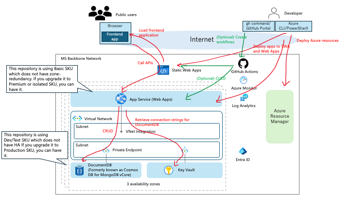

# Day 0: 事前準備

このページでは、Cloud Shell から Azure PaaS リソースを作成するためのサブスクリプション、Provider、リージョン、費用の前提を確認します。

## 1. アーキテクチャを確認する



このワークショップでは、受講者が Cloud Shell から Azure CLI、Bicep、デプロイスクリプトを使い、VM を直接管理せずに PaaS 構成のブログアプリを作成します。

全体像は次の通りです。

| 領域 | Azure サービス | 役割 |
|---|---|---|
| フロントエンド | Azure Static Web Apps | React アプリを配信し、`/api/*` をバックエンドへルーティングします。 |
| バックエンド API | Azure App Service | Node.js API を実行し、Microsoft Entra ID のトークンを検証します。 |
| データ | Azure Cosmos DB for MongoDB vCore | ブログ記事やユーザー情報を保存します。 |
| シークレット | Azure Key Vault | Cosmos DB 接続文字列などを保存し、App Service の Managed Identity で参照します。 |
| 監視 | Application Insights / Log Analytics | アプリのログ、依存関係、障害調査に使います。 |
| ネットワーク | VNet Integration / Private Endpoint / NAT Gateway | App Service から private endpoint 経由でデータ層へ接続します。 |

AWS に慣れている場合は、アプリ実行基盤を EC2 ではなく、Elastic Beanstalk や Amplify、Secrets Manager、CloudWatch Logs のような managed service の組み合わせとして捉えると理解しやすくなります。

## 2. サブスクリプションを確認する

```bash
az account show --query "{name:name,id:id,tenantId:tenantId}" --output table
```

講師指定のサブスクリプションと異なる場合は切り替えます。

```bash
az account set --subscription "<subscription-id-or-name>"
az account show --output table
```

## 3. リソースグループ名を確認する

```bash
echo "Resource group: $RESOURCE_GROUP"
echo "Primary region: $LOCATION"
echo "Static Web Apps region: $SWA_LOCATION"
```

グループ演習では、`GROUP_ID` をチームごとに変えてリソース名の衝突を避けます。

```bash
export GROUP_ID="A"
export RESOURCE_GROUP="rg-${BASE_NAME}-${GROUP_ID}-workshop"
```

## 4. Resource Provider を登録する

このワークショップでは、App Service、Static Web Apps、Cosmos DB/DocumentDB、Key Vault、Monitor/Alerts Management、Network を使います。

```bash
for ns in \
  Microsoft.Web \
  Microsoft.DocumentDB \
  Microsoft.KeyVault \
  Microsoft.Insights \
  Microsoft.AlertsManagement \
  Microsoft.OperationalInsights \
  Microsoft.Network \
  Microsoft.Authorization
do
  state=$(az provider show --namespace "$ns" --query registrationState -o tsv 2>/dev/null || echo NotRegistered)
  echo "$ns: $state"
  if [ "$state" != "Registered" ]; then
    az provider register --namespace "$ns"
  fi
done
```

登録状態を確認します。

```bash
for ns in Microsoft.Web Microsoft.DocumentDB Microsoft.KeyVault Microsoft.Insights Microsoft.AlertsManagement Microsoft.OperationalInsights Microsoft.Network Microsoft.Authorization
do
  az provider show --namespace "$ns" --query "{namespace:namespace,state:registrationState}" -o table
done
```

すべて `Registered` になるまで数分かかることがあります。

`Microsoft.AlertsManagement` が未登録の場合、Application Insights の `Failure Anomalies` アラート作成でデプロイが失敗することがあります。

## 5. Quota と費用の前提を確認する

Cloud Shell 手順では、ワークショップ向けの小さな SKU を使います。

| リソース | 既定 |
|---|---|
| App Service Plan | B1 |
| Static Web Apps | Standard (Linked Backend に必要) |
| Cosmos DB / DocumentDB | M25 |
| Cosmos DB HA | false |

> Static Web Apps Linked Backend は Free SKU では利用できません。このワークショップでは `/api/*` を App Service にルーティングするため Standard を使います。

App Service SKU の利用可否はサブスクリプションやリージョンによって異なります。デプロイ時に quota エラーが出た場合は講師に相談してください。

## 6. 作業用リソースグループを作成する

```bash
az group create \
  --name "$RESOURCE_GROUP" \
  --location "$LOCATION" \
  --tags Workshop=Azure-PaaS-Workshop GroupId="$GROUP_ID"
```

確認します。

```bash
az group show --name "$RESOURCE_GROUP" --output table
```

## 次に進む

- [Day 0: Entra ID と認証設定](day-0-entra-id.ja.html)
